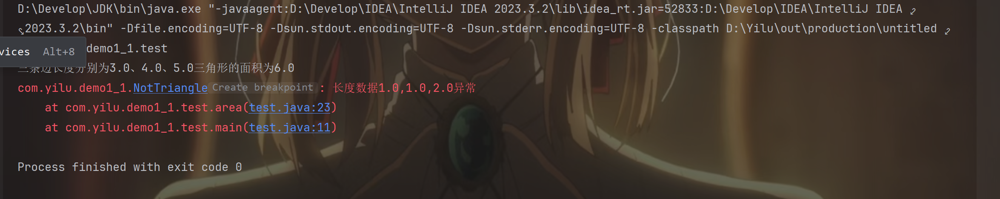
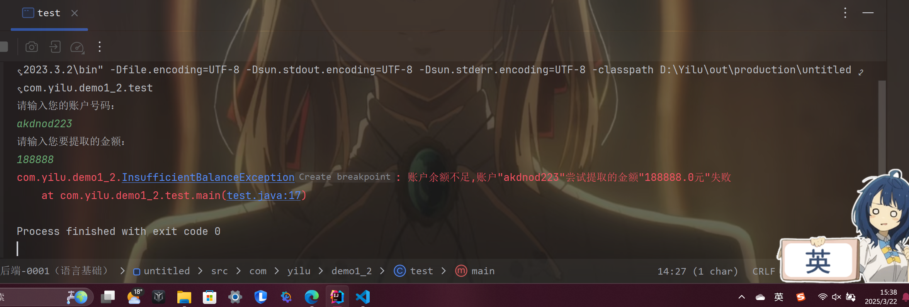
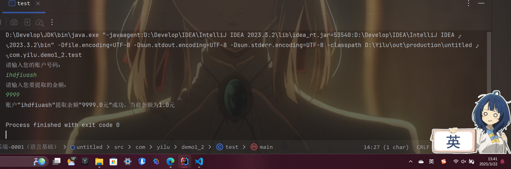
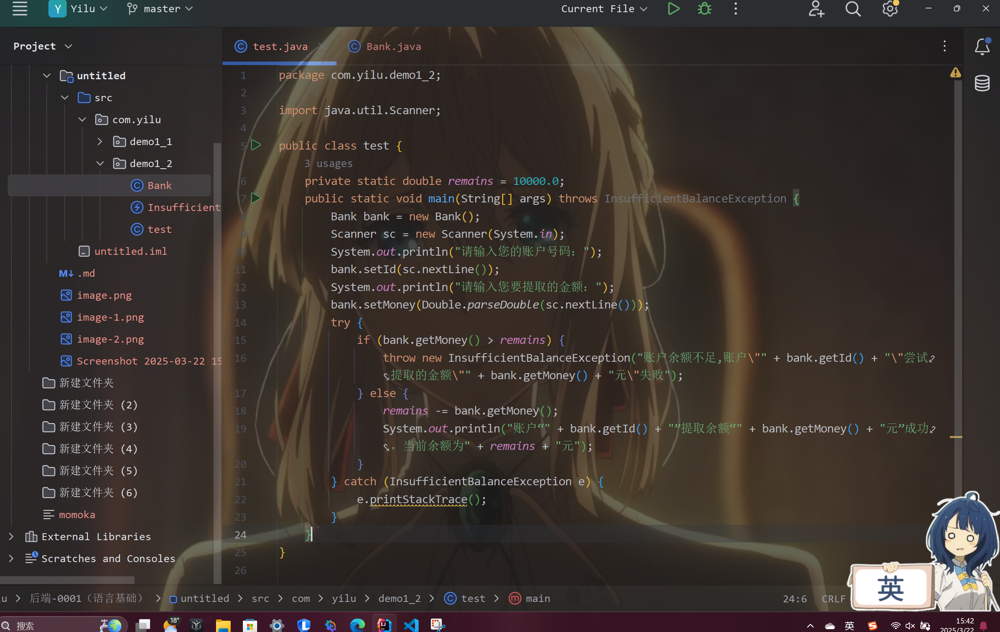

### 本节任务
#### 1. 什么是面向对象？
面向对象编程是一种编程范式，核心思想是用“对象”来模拟现实世界。对象是类的实例，类是对象的模板。
**具有四大特征：**
-   封装：把数据和操作数据的方法打包在一起。
-   继承：子类可以继承父类的属性和方法，实现代码复用。
-   多态：同一个方法在不同对象中有不同的实现，比如“叫”方法，猫和狗叫的声音不同。
-   抽象：提取关键特征，忽略细节，比如“动物”是一个抽象概念，具体可以是猫、狗。
#### 2. 静态方法和构造方法有什么区别？
-   构造方法是造对象的，每次new一个对象时都会调用，不能有返回值。比如Javabean里面的空参构造，代参构造，get方法和set方法，还有tostring方法
-   静态方法是直接用类调的工具方法，用static修饰，属于类而不是对象，并且直接用类名调用，不能访问非静态成员

#### 3. 在Java中修饰符有哪些？什么情况下使用？使用对象是什么？
Java中的修饰符主要分为两类：访问修饰符和非访问修饰符。
-   访问修饰符（控制谁能访问）：
    -   public：谁都能用
    -   protected：同一个包内或子类能用
    -   default（不写）：同一个包内能用。
    -   private：只有自己类里能用。

-   非访问修饰符（加特殊功能）：
    -   static：属于类，不是对象。
    -   final：不能改。(相当于C语言的const)
    -   abstract：抽象，不能直接实例化，修饰方法时要重写方法
    -   synchronized：多线程时用，防止冲突，上锁

使用场景：
类：public、abstract、final。

方法：public、private、protected、static、final、abstract、synchronized。

变量：public、private、protected、static、final、transient、volatile。
#### 4. 掌握以下三种类型的异常：
-   检查性异常： 最具代表的检查性异常是用户错误或问题引起的异常，这是程序员无法预见的。例如要打开一个不存在文件时，一个异常就发生了，这些异常在编译时不能被简单地忽略。
-   运行时异常： 运行时异常是可能被程序员避免的异常。与检查性异常相反，运行时异常可以在编译时被忽略。
-   错误： 错误不是异常，而是脱离程序员控制的问题。错误在代码中通常被忽略。例如，当栈溢出时，一个错误就发生了，它们在编译也检查不到的。
####    第一题
-   没碰到什么问题
-   **运行结果：**

-   下面是源码

```
package com.yilu.demo1_1;

public class test {
    public static void main(String[] args) {

        Triangle tr1 = new Triangle(3.0, 4.0, 5.0);
        Triangle tr2 = new Triangle(1.0, 1.0, 2.0);

        try {
            System.out.println("三条边长度分别为" + tr1.
            getLen1() + "、" + tr1.getLen2() + "、" + tr1.
            getLen3() + "三角形的面积为" + area(tr1));
            System.out.println("三条边长度分别为" + tr2.
            getLen1() + "、" + tr2.getLen2() + "、" + tr2.
            getLen3() + "三角形的面积为" + area(tr2));

        } catch (NotTriangle e) {
            e.printStackTrace();
        }
    }

    private static double area(Triangle triangle) {
        double len1 = triangle.getLen1();
        double len2 = triangle.getLen2();
        double len3 = triangle.getLen3();
        if (!(len1 > 0 && len2 > 0 && len3 > 0 && (len1 + 
        len2 > len3))) {
            throw new NotTriangle("长度数据" + len1 + "," 
            + len2 + "," + len3 + "异常");
        }
        double p = (len1 + len2 + len3) / 2;
        return Math.sqrt(p * (p - len1) * (p - len2) * (p - len3));
    }
}
```
-   test类里面是area()方法，以及main方法里面的try...catch语句，用e.printStackTrace();来在控制台展出异常信息
-   还创建了Triangle类的javabean用来描述三角形()
-   自定义了继承RuntimeException类的NotTriangle类来描述错误
####    第二题
-   也没碰到什么问题
#####   运行结果1：(输入错误数据，抛出异常)

#####   运行结果2：(输入正常数据)

#####   源码如下(test类)：

-   自定义了名为 InsufficientBalanceException的异常类，该异常类继承Exception 类
```
\\该类中包含一个带有错误信息参数的构造函数
public InsufficientBalanceException(String message) {
        super(message);
    }
```
```
\\在抛出异常时，错误信息包含了账户号码和尝试提取的金额
try {
            if (bank.getMoney() > remains) {
                throw new InsufficientBalanceException("账
                户余额不足,账户\"" + bank.getId() + "\"尝试
                提取的金额\"" + bank.getMoney() + "元\"失败
                ");
            } else {
                remains -= bank.getMoney();
                System.out.println("账户“" + bank.getId() 
                + "”提取余额“" + bank.getMoney() + "元”成
                功，当前余额为" + remains + "元");
            }
        } catch (InsufficientBalanceException e) {
            e.printStackTrace();
        }
```