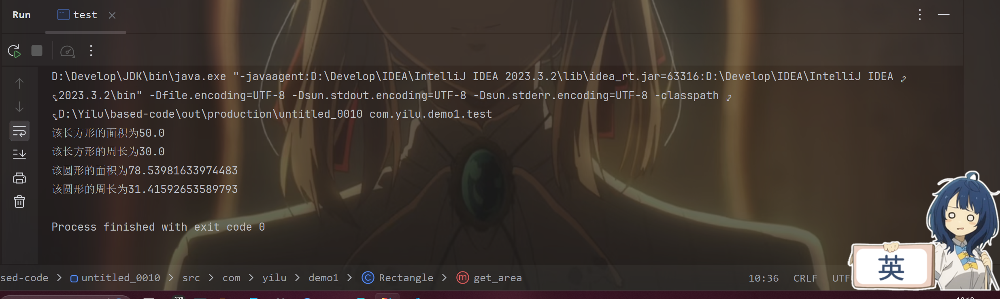
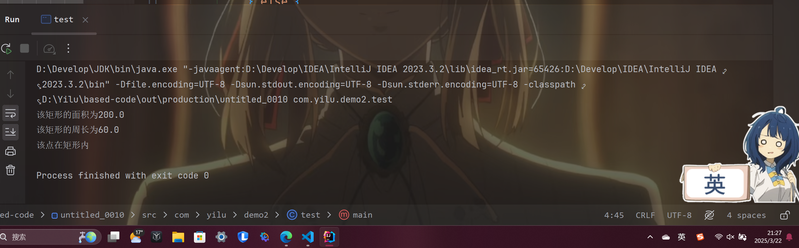

####    本节任务
####    Java的三大基本特征是什么？ 尝试编写一些示例代码与理论相验证。
**封装、继承、多态**
-   封装(比如Javabean)
```
public class Student {
    private String name; 
    public String getName() { 
        return name;
    }
}
```
-   继承(子类父类)
```
public class Animal {//父类
    void eat() { 
        System.out.println("Eating..."); 
    }
}
class Dog extends Animal { // 继承
    void bark() {
        System.out.println("Barking..."); 
    }
}
```
-   多态
```
class Animal {
    void sound() { 
        System.out.println("动物朋友们的声音"); 
    }
}
class Dog extends Animal {
    void sound() { 
        System.out.println("大狗大狗叫叫叫！！！"); 
    } // 重写
}
class Cat extends Animal {
    void sound() { 
        System.out.println("喵喵？"); 
    } // 重写
}
```
####    抽象类是什么？
抽象类是一个不能直接创建对象的类，它用来作为其他类的模板，它要用 abstract 修饰，既可以包含抽象方法，也可以包含普通方法和属性，不能直接 new 一个抽象类对象
####    接口是什么？
接口是 Java 中的一种特殊类型，它定义了一组方法的规范，但没有具体实现。

----
### *第一题*(源码在文件夹里面都有)
####    运行结果：

#### 代码截图

-   碰到的问题：
    -   两个实例在调用方法时，所需的参数个数不同，要在接口里面创建四个不同的抽象方法，但这样在Circle，Rectangle两个类里面分别要重写四个方法，太麻烦
- 解决方法：

1. 可以将接口的方法用static修饰，这样还不用在 Circle，Rectangle两个类中重写方法，并且在test方法中可以直接调用接口里的方法
```
public interface Perarea {
    public static double get_area(double radius) {
        double area = Math.PI * Math.pow(radius, 2);
        System.out.println("该圆形的面积为" + area);
        return area;
    }

    static double get_perimeter(double radius) {
        double perimeter = 2 * Math.PI * radius;
        System.out.println("该圆形的周长为" + perimeter);
        return perimeter;
    }

    static double get_area(double len, double wid) {
        double area = len * wid;
        System.out.println("该长方形的面积为" + area);
        return area;
    }

    static double get_perimeter(double len, double wid) {
        double perimiter = (len + wid) * 2;
        System.out.println("该长方形的周长为" + perimiter);
        return perimiter;
    }
}
```
2. 或者将接口的方法都用default修饰，这样就不用强制重写4个方法了
```
default double get_area(double a) {
        return 0;
    }

    default double get_perimeter(double a) {
        return 0;
    }

    default double get_area(double a, double b) {
        return 0;
    }

    default double get_perimeter(double a, double b) {
        return 0;
    }
```

3. 再或者用接口适配器，利用接口的多态来简化代码。

----
### *第二题*(源码在文件夹里面都有)
####    没碰到什么问题
#### 运行结果：

-   Rect中的两个实例方法

-   Rect中的两个构造方法

-   PlainRect中的两个构造方法

-   PlainRect中的isInside方法

