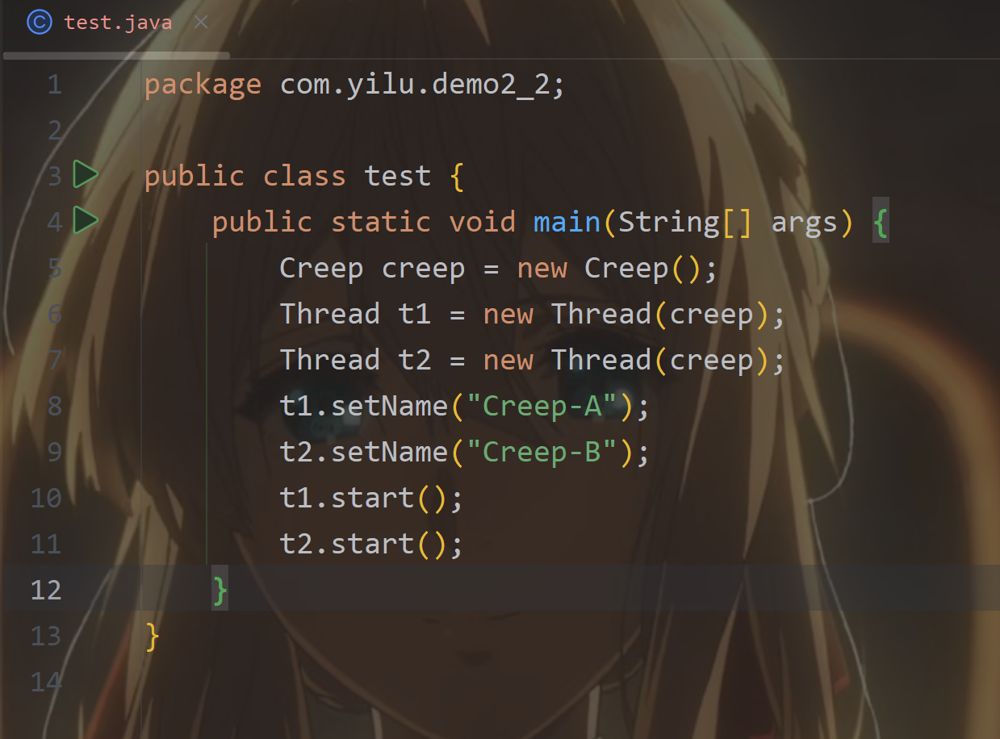
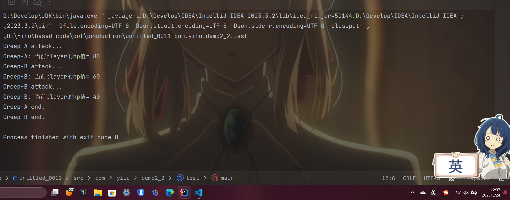
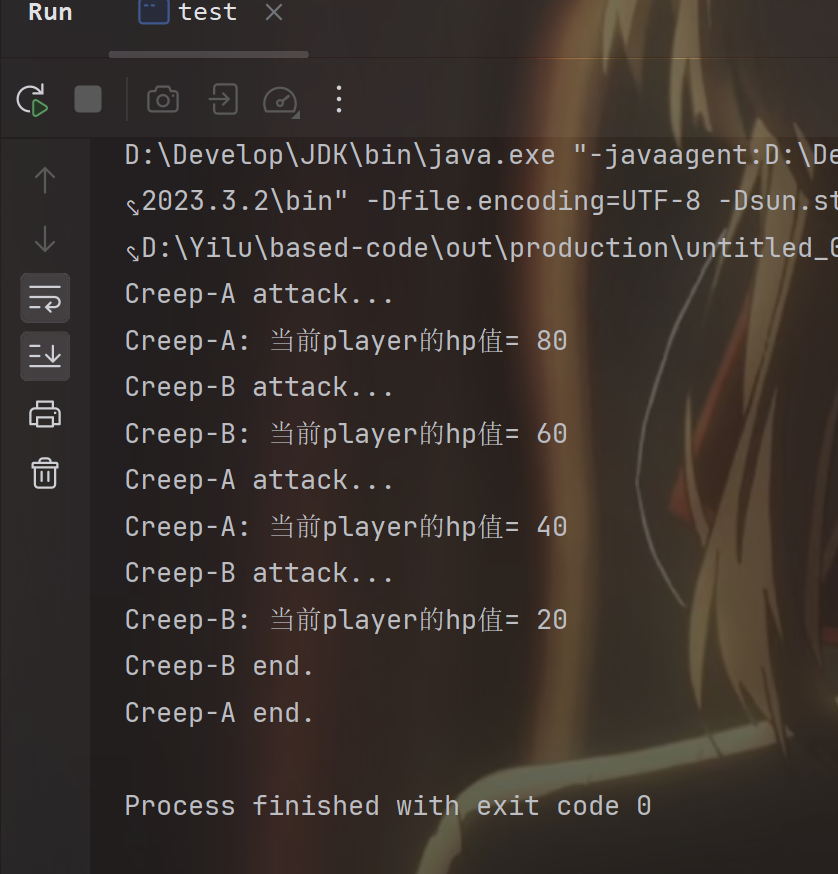

##   题目描述
#### 1. 生产者与消费者模型
现在有生产者和消费者两种角色，生产者可以产生资料。消费者可以对生产者产生的资料进行消费。

**要求:**
-   对生产者和消费者进行抽象形成接口 (interface)（思考一下每种角色应有什么功能，不限于上述）;
-   按照你自己的需求实现消费者和生产者 (implements)（如：芝士雪豹）;
-   依据多线程知识，使用你实现的类进行多个消费者并发消费生产者的资料的活动（尝试多种加锁方式）;
-   并谈谈如果不使用锁可能会出现哪些问题。
注：你可能需要为生产资料提供一个类。

------


------

#### 2. 攻击程序
实现功能：一名玩家分别受到 Creep-A, Creep-B 攻击三次，每次减少 20hp 值，玩家初始 hp 值为 100，当玩家 hp 值为 0 时，玩家死亡。

**输出示例：**
```
Creep-A attack...
Creep-A: 当前player的hp值= 80
Creep-A attack...
Creep-A: 当前player的hp值= 60
Creep-A attack...
Creep-A: 当前player的hp值= 40
Creep-A end.
Creep-B attack...
Creep-B: 当前player的hp值= 20
Creep-B attack...
Creep-B: 当前player的hp值= 0
Creep-B: player is dead.
Creep-B end.
```
用同步块和同步方法两种方式实现。

----

***同步代码块：***
#####   遇到的问题：
-   碰上了一个很逆天的问题，出现了A与B都打印了 “player is dead.”  而且A攻击完了之后，不仅没有立即打印“Creep-A end.”，还打印了两次“Creep-A end.”！
    -   
-   下面是问题代码（这是Creep类，test类没问题）
    -   
-   初步改进：
    -   
- 改进原因：
  -   为何有两次“player is dead.” 
      - 在问题代码中，hp 是一个 静态变量，被所有 Creep 实例共享。当 hp 被减少到 0 时，Creep-A 和 Creep-B 都会检查 hp 的值。
      - synchronized 块只保证了同一时间只有一个线程可以执行块内的代码，但它并不能阻止其他线程在释放锁后进入块并检查条件。
      - hp 是静态变量，所有线程共享同一个 hp 值。当一个线程将 hp 减少到 0 后，其他线程在进入 synchronized 块时也会看到 hp == 0。
  - 为何打印了两次“Creep-A end.”
    - count 是 实例变量，每个 Creep 实例都有自己的 count。在问题代码中，当 count 减少到 0 时，每个线程都会检查自己的 count 值。
    - synchronized 块只保护了 hp 的修改，但没有保护 count 的修改。因此，Creep-A 和 Creep-B 可以同时减少各自的 count。
- 再次完善：
  - 添加了
    - if (count == 0) {
                break; // 如果 count 已经为 0，直接退出
            }
  - 
- 再次改进原因： 
  - 避免不必要的 Thread.sleep(100),确保线程及时退出
    - 如果 count 已经为 0，线程应该立即退出循环，而不是再执行一次 Thread.sleep(100)。
    -   如果没有在 synchronized 块外部检查 count 的值，线程可能会在 count 已经为 0 的情况下，仍然执行 Thread.sleep(100)，然后再进入 while 循环，发现 count == 0 并退出。这样会导致线程多休眠 100 毫秒，影响程序的效率。

- 下面是更符合题目所要求输出示例的代码，就是把sleep放锁里面
  - 
  - 
-----

***同步方法：***
- 只要把同步代码块解法里面由 synchronized 块包裹的代码抽取成方法即可
- 这次尝试用Runnable接口的方式来实现，这样在tset类里面要创建一个Creep的对象，再把该对象传递进两个线程中
  - 
- 遇到的问题：
  - 这样意味着Creep类里面的hp与count两个线程是共享的，hp就不用static修饰了，但是两个线程同时共享一个count又出了bug
  - 
  - 
- 修改后代码，用ThreadLocal把count定义为线程局部变量  ***private ThreadLocal<Integer> count = ThreadLocal.withInitial(() -> 3);***
  - 
- 运行结果：
  - 

------
####    3. Java实现泛型链表
要完成该题，我们需要先对C语言中的链表有完整的学习，然后，请用Java实现一个泛型链表并提供相应API。

boolean addList(Node node) 添加结点
void removeList0() 删除尾结点
void removelistByValue(int value) 根据节点值删除节点
int find(int value) 找到值为 value 的结点，返回这个结点下标（下标从 0 开始计算）
提示：具体的设计可以参考 LinkedList 的源码。


