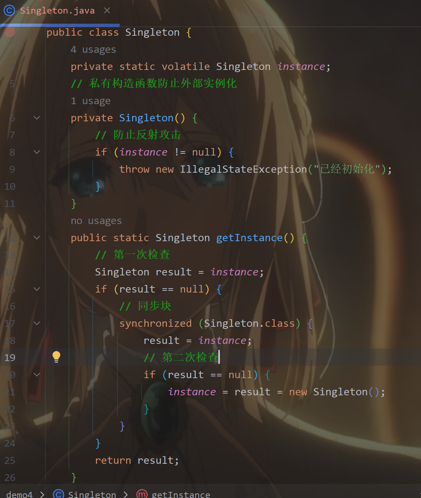
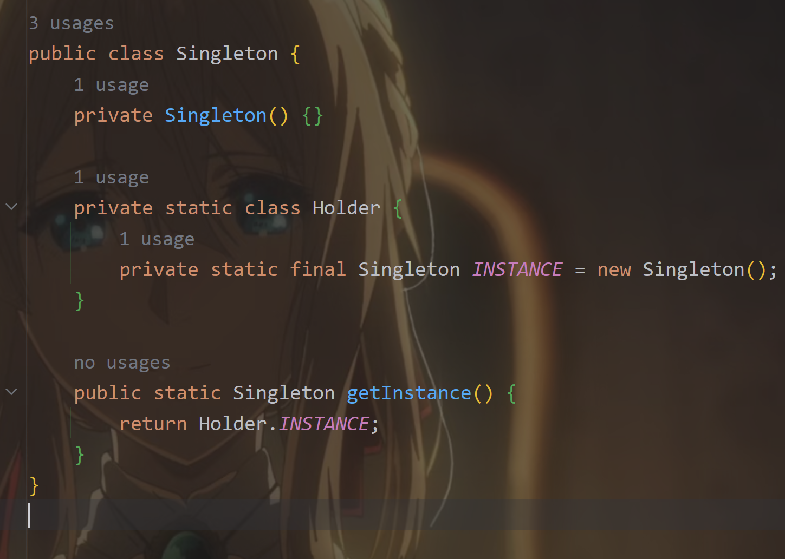

###  设计模式相关要点
-   设计模式是什么？
    -   设计模式是软件工程中用于解决常见设计问题的可重用解决方案。它们不是具体的代码，而是一种经过验证的设计思想，帮助开发者编写代码。
        -   设计模式让代码更易于维护。
        -   很多问题已经有现成的解决方案，直接拿来用就好。
        -   设计模式是通用的“语言”
-   JDK 中常用的设计模式有哪些？
    -   创建型模式：解决对象创建的问题。
    -   结构型模式：解决类和对象组合的问题。
    -   行为型模式：解决对象之间的交互问题。
-   单例模式是什么？ 请用 Java 写出线程安全的单例模式。
    -  这个是线程安全的单例模式实现（双重检查锁定方式）：     
    -  更简洁的实现方式（静态内部类方式）：                  
-   使用工厂模式有哪些好处？ 说说它的应用场景。
    -   好处：
        -   工厂模式让代码更灵活，避免到处写new，方便后续维护和扩展。
        -   解耦：调用方无需关心对象如何创建。

        -   扩展方便：新增产品类型时，只需修改工厂，不影响现有代码。

        -   统一管理：可集中控制对象的创建逻辑（如缓存、依赖注入）。
    -   应用场景:
        -   需要动态创建不同子类对象时（如支付方式、数据库驱动）。

        -   对象创建过程复杂或需要复用时（如线程池、连接池）。
